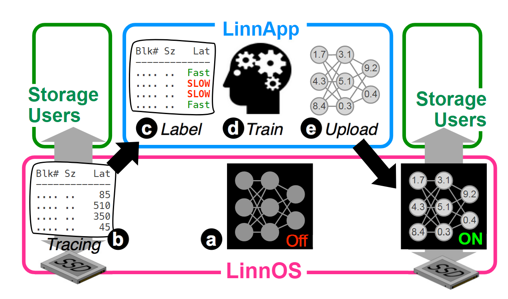
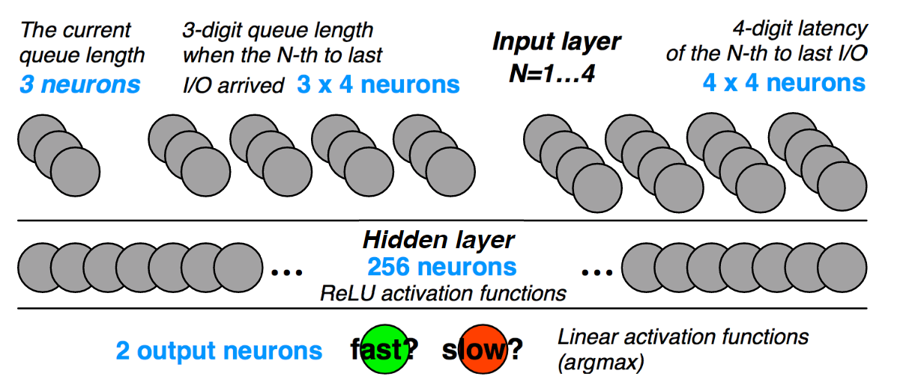

#### [1. Operating Systems must support GPU abstractions](../Papers/Operating%20Systems%20must%20support%20GPU%20abstractions.pdf)
**Background**:
- Most systems view GPU as I/O device, which only provides limited system calls, and lack of modularity, and thus difficult to programming and cannot ensure fairness, isolation and performance.
- For GPU scheduling, current GPU framework uses vendor-provided scheduling algorithm (simple), and sometimes violate fairness.

**Motivation**:
- System spends far more time marshaling data structures and migrating data than it does actually computing on the GPU.
- When two unrelated tasks: CPU-bounded and GPU-bounded tasks execute, the load cannot balance the entire system effectively. GPUs are not preemptible, and Windows is also unable to interrupt GPU programs.

**Main Contribution**: 
- A kernel abstraction to manage interactive and high-compute devices like GPUs (and other accelerator devices).

**Proposed OS Abstractions**:
- *PTask* analogous to process
- *Port* 
- *Channel* analogous to pipe
- *Graph*
- Design new system calls support PTask
- For long-latency computation PTasks, the scheduler can serve it when the CPU threads are blocked.
- When a process's CPU threads are waiting for low-latency computation PTasks, it can either busy-wait, or use CPU computation resources to help GPU computation.

#### [2. PTask: Operating System Abstractions To Manage GPUs as Compute Devices](../Papers/PTask_Operating%20System%20Abstractions%20to%20Manage%20GPUs%20as%20Compute%20Devices.pdf)
Note: Discuss in detail compared to [1](../Papers/Operating%20Systems%20must%20support%20GPU%20abstractions.pdf). Background and motivation are the same. A good example for explaining the unnecessary data movement in Figure 6.

**Detailed Proposed OS Abstractions**: 
- *Port*: three different types. 
  - InputPort, OutputPort, and StickyPort
  - Two status: occupied and unoccupied
- *Datablock*: contain a unit of data flow along the data graph
  - Buffer-map: map memory spaces to device specific buffer object. (Divide seperately)
  - My understanding: For example, the datablock is created in the buffer in CPU memory, and when we utilize GPU to accelerate (say in ptask), it will generate a new view (a buffer in GPU memory), and track this most up-to-date view.
- *Template*: provide meta-data describing datablock (dimension, layout, types of resources)
- A thread pool for GPU dispatch and port data movement
- *Channels* have capacity.
- For Output has variable length, first run on GPU to determine the output size and offset. Dynamical allocation is impossible.
- PTask status:
  - Waiting (for inputs)
  - Queued(inputs available, waiting for a GPU)
  - Executing (running on the GPU)
  - Completed (finished execution, waiting to have its outputs consumed)

**PTask Prototype Implementation**:
- *Scheduling Policy*: 
  - First-available: access is arbitrated by locks on the accelerator (GPU) data structures
  - FIFO
  - Priority: 
    - re-calculate priority at status transitions. Sort based on proxy priority (evaluation in Table 4), static priority, wait time and runtime. Sum as a weighted function.
    - Rank accelerator: based on number of cores, core clock speed and so on.
  - Data-aware: 
    - consider the majority of a ptask's input's memory space. (less data migration)
    - It's possible to leave a ptask on the queue even if there are available accelerators.
  - Each process using a GPU maintains a budget Bp. The budget will be replenish in period, and the maximum budget is related with priority of the process.

**Evaluation**:
- *Evaluation Logic*: 
  - Performance: low latency, high throughput, stable bandwidth, and speedup.
  - Fairness: measure with and without scheduling policy/ compare different policy's speedup and priority concern
  - Isolation: implement modular and non-modular version
- Baseline: host-based. not use GPU.
- Handcode: use DXGI system
- Pipes: use four separated process connected by pipes, camera driver map data directly 
- Modular: similar to pipe, but one process
- Ptask
- Measured in real-time (latency) and unconstrained (throughput) mode.
- *Overheads*:
  - Memory to represent data structures
  - Threads to manage ptask
- *Benchmarks*: seven tasks including simple tasks like matrix multiply and harder task like PCA.

**Questions** for evaluation results:
- High throughput and low latency for ptask, but low GPU utilization. I guess the non-work-conserving scheduling policy may be the cause.

**Limitation** (mentioned in the article):
- Can only support *static graph* [doesn't support cyclic / dynamic / algorithms that are hard to construct data-flow graph]
- Solution1: unrolling loop
- Solution2: expressed as a single ptask graph.
- In user-mode, it is still possible for processes to access GPU directly which violates fairness and isolation.
- Buffers are unswappable, under high memory load situation, the inputs may not always be materialized.

Need to study:
- GPU Computing

#### [3. GPU Architecture](../Papers/General-purpose%20graphics%20processor%20architectures.pdf)
**Introduction**
Key challenge:
- Balance between efficiency and flexibility

GPU Hardware Basics:
- CPU is responsible for initiating computation on the GPU and transferring data to and from the GPU.
- System contain GPU and CPU:
.png)
 
- Composed of many cores (streaming multiprocessors/ compute units)
- Each core executes a SIMT program 

- Performance comparison between CPU and GPU:
  - CPU: ALU and Control Unit
  - GPU: ALU (less control flow)

**Programming Model for GPU**
Execution Model:
- CPU allocate memory in GPU--launch kernel in GPU.
- Grid size (how many thread blocks), Thread Block size (how many threads in a block)
- Shared memory and local data store (software controlled GPU cache)--scratchpad memory

**SIMT Core**

- Threads are organized into wraps
- Warp is the unit of scheduling
- **Single Loop**:
  - Select a warp
  - Fetch instruction and decode
  - Fetch source operand registers
  - Determine SIMT execution mask values (Mask means some threads execute the instruction-1 while some not-0):
    - Done by pushing on the SIMT stack
    - May encounter Deadlock problem (Solution: replace the stack with per warp convergence barriers)
      - Need to introduce more fields
      - Free to switch between groups of diverged threads

- **Two Loop**:
  - Issue a subsequent instruction from a warp while earlier instructions have not yet completed.
  - How CPU implement:
    - Scoreboard (Record whether the unit is busy or not, source/destination registers, flags and so on)
      - Problem when using it in GPU: 1. large number of registers 2. repeatedly lookup
  - GPU Scoreboard: each entry is the identifier of a register that will be written by an instruction that has been issued but not yet completed execution. Compare dependency with this bits.

- **Three Loop**:

  - Benefits of Collection Units: help improve throughput in the presence of Sbank conflicts between the source operands of individual instructions

**Memory System**
- Two separate memory spaces: Register File and Memory.

- L1 Data Cache:

  - A memory access request consists of a set of memory addresses.
  - For shared memory, divide into: have bank conflict part (replay) and direct access part.

Note: still reading... (60/142)

#### [4. Honeycomb](../Papers/Honeycomb-Secure%20and%20Efficient%20GPU%20Executions%20via%20Static%20Validation.pdf)

**Trusted Execution Environments**: 
Allocate a separate, isolated memory in the hardware for sensitive data, where all computations of sensitive data take place, and where the information in this isolated memory is inaccessible to other parts of the hardware than authorized interfaces. In that way, the privacy calculation for sensitive data can be realized.

**Benefits**:
Using **static analysis** to validate that mutually distrusted GPU applications are confined to their enclaves.
- Complement the hardware limitation (Raspberry Pi VC4)
- Load check instead of runtime check (reduce overhead)
- Security invariant reduce overheads (originally using IPC)

**Challenges**:
- Balance trade-offs between the capabilities and the complexities of the validator
- Minimize TCB, minimize trust on software/hardware stack in GPU
- Provide system-level support for secure and efficient IPC

Notes: still reading...

#### [5. Towards a Machine Learning-Assisted Kernel with LAKE](../Papers/LAKE.pdf)

**Motivations**:
- With the increase of software and hardware complexity, people start to navigate OS trade-off using machine learning techniques.
- Fixed-pattern algorithm not perform well.
- Previous works focus on individual subsystems such as CPU load balancing and I/O latency predictions, but not integrate ML decision into an OS kernel. This requires kernel-level APIs to control accelerators.

**Challenges**:
- Poor accessibility of accelerators in kernel space. 
- Need clear mechanism to manage the contention between kernel-space API call and user-space API-call. (Concern: will user-level GPU using having effect on the OS decision making?)
- Cross-layer data sharing.

**Design**:
- Because libraries supplied by accelerators' vendors are designed for user space, so it is necessary to provide kernel space applications to use accelerators.
- Zero-copy memory movement: lakeShm and lakeD map the same memory region.
- Three categories of operations
  - local operations
  - API-remoted operations
  - Copiable memory allocations (My understanding: copy from Host to GPU or copy from GPU to host)
  - Problem when reading: this system seems implement a remote accelerator API workflow instead of reducing costs or redundant data copy between kernel and user. Their workflow just doesn't introduce extra data copy. 
  - Some data structure like NumPy array doesn't exist in kernel space, and thus need to do additional conversion.
- In kernel feature registry：
  - Overhead
  - Registry Schema (feature key, <size, entries>)
  - Insert code at I/O issue and completion, if time quantum has passed or reach batch size, start batch inference.

**Implementation**:
- Netlink socket: a kind of IPC, communication between Linux kernel space and user space
- Use Mapped Memory for large data transfer

**Evaluation**:
- Baseline: no network help
- Network based on CPU
- Use GPU for network acceleration

**Security**:
- Private data from kernel to user-space (Address-space separation/ sandbox and seccomp) --mentioned in the paper
- Scheduling problem: will occupying GPU by other user-level programs have effect on the OS decision making, vise-versa?

**Notes**:
Other hardware accelerator: GraphCore IPU/ Google TPU

#### [6. LinnOS: Predictability on Unpredictable Flash Storage with a Light Neural Network](../Papers/LinnOS_Predictability%20on%20Unpredictable%20Flash%20Storage%20with%20a%20Light%20Neural%20Network)

**Motivation**:
- Complexity in redesign the file systems or applications. (Traditional way: speculative execution--send a duplicate I/O to another device/node)
- Unpredictable latencies of read-write servers

**Design**:

- Unique weights for different devices (huge amount of parameters)
- Training data collection using busy-hour trace
- Finding Inflection Point:
  - Calculate the largest boost area (using simulation approach)
- Light Neural Network:

  - Input: pending I/Os / latency and pending I/Os of 4 most-recently completed I/Os
