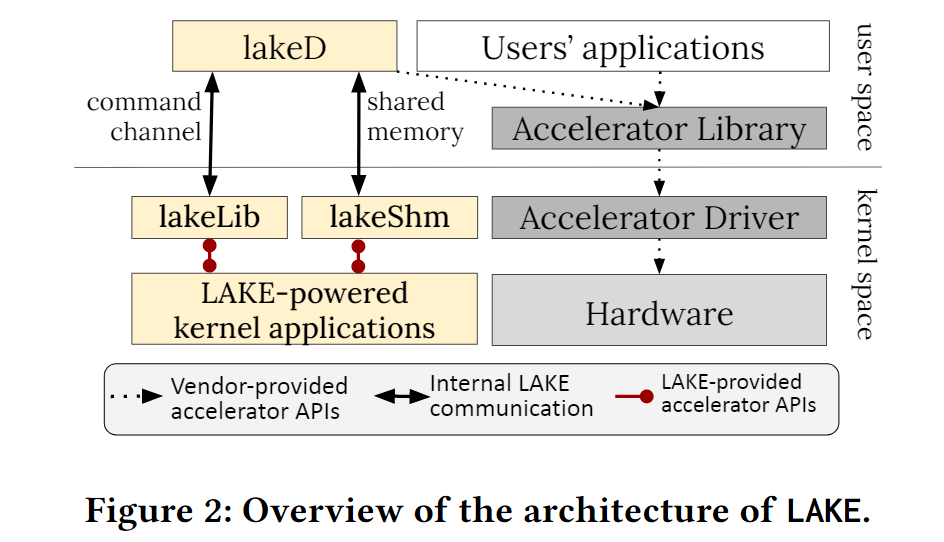
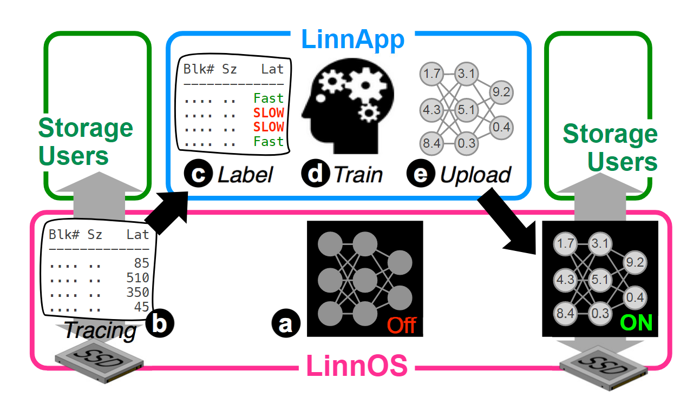
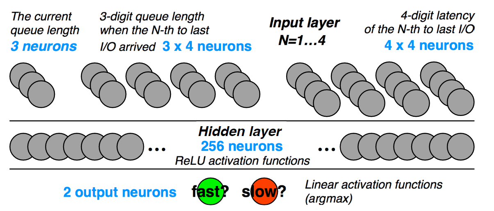
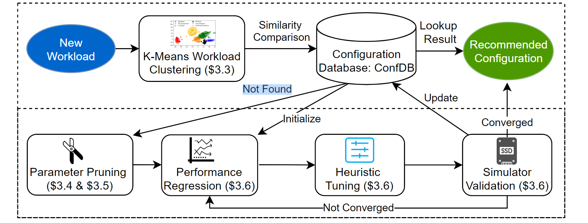
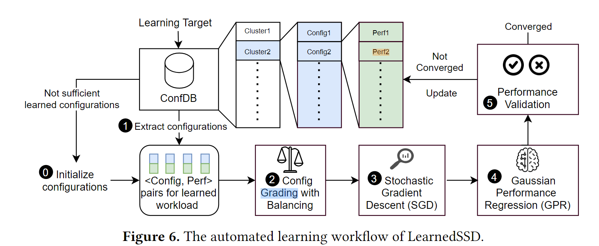
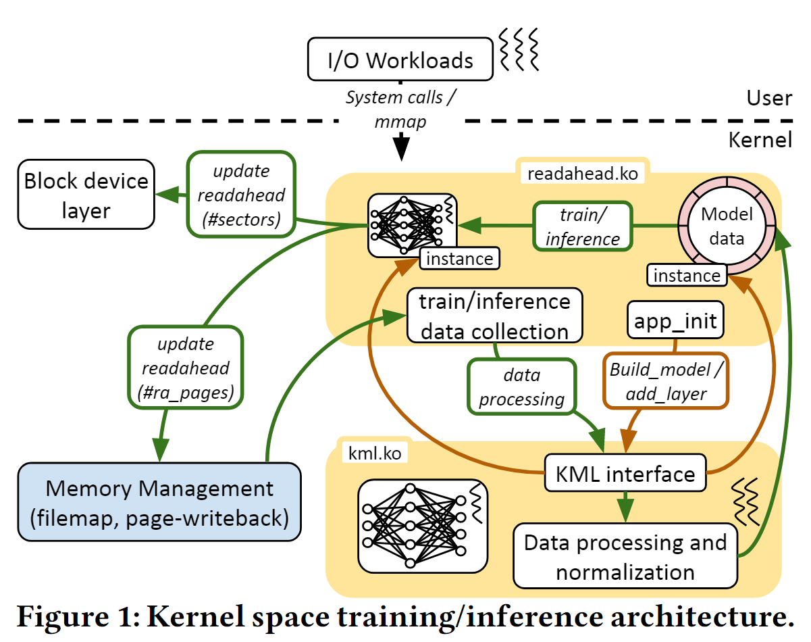

#### [1. Towards a Machine Learning-Assisted Kernel with LAKE](../Papers/LAKE.pdf)

**Motivations**:
- With the increase of software and hardware complexity, people start to navigate OS trade-off using machine learning techniques.
- Fixed-pattern algorithm not perform well.
- Previous works focus on individual subsystems such as CPU load balancing and I/O latency predictions, but not integrate ML decision into an OS kernel. This requires kernel-level APIs to control accelerators.

**Challenges**:
- Poor accessibility of accelerators in kernel space. 
- Need clear mechanism to manage the contention between kernel-space API call and user-space API-call. (Concern: will user-level GPU using having effect on the OS decision making?)
- Cross-layer data sharing.

**Design**:
- Because libraries supplied by accelerators' vendors are designed for user space, so it is necessary to provide kernel space applications to use accelerators.
- Zero-copy memory movement: lakeShm and lakeD map the same memory region.
- Three categories of operations
  - local operations
  - API-remoted operations
  - Copiable memory allocations (My understanding: copy from Host to GPU or copy from GPU to host)
  - Problem when reading: this system seems implement a remote accelerator API workflow instead of reducing costs or redundant data copy between kernel and user. Their workflow just doesn't introduce extra data copy. 
  - Some data structure like NumPy array doesn't exist in kernel space, and thus need to do additional conversion.
- In kernel feature registry：
  - Overhead
  - Registry Schema (feature key, <size, entries>)
  - Insert code at I/O issue and completion, if time quantum has passed or reach batch size, start batch inference.

**Implementation**:
- Netlink socket: a kind of IPC, communication between Linux kernel space and user space
- Use Mapped Memory for large data transfer

**Evaluation**:
- Baseline: no network help
- Network based on CPU
- Use GPU for network acceleration

**Security**:
- Private data from kernel to user-space (Address-space separation/ sandbox and seccomp) --mentioned in the paper
- Scheduling problem: will occupying GPU by other user-level programs have effect on the OS decision making, vise-versa?

**Notes**:
Other hardware accelerator: GraphCore IPU/ Google TPU

#### [2. LinnOS: Predictability on Unpredictable Flash Storage with a Light Neural Network](../Papers/LinnOS_Predictability%20on%20Unpredictable%20Flash%20Storage%20with%20a%20Light%20Neural%20Network)

**Motivation**:
- Complexity in redesign the file systems or applications. (Traditional way: speculative execution--send a duplicate I/O to another device/node)
- Unpredictable latencies of read-write servers

**Design**:

- Unique weights for different devices (huge amount of parameters)
- Training data collection using busy-hour trace
- Finding Inflection Point:
  - Calculate the largest boost area (using simulation approach)
- Light Neural Network:

  - Input: pending I/Os / latency and pending I/Os of 4 most-recently completed I/Os
  - For simplification, formate input into several decimal digits
  - Use biased training to reduce false submits (more penalty weights for false submits)
  - Quantization and co-processor for optimization

**Evaluation**:
- baseline, cloning, constant-percentile hedging (e.g., at p95 latency), inflection point hedging (with our algorithm), simple heuristic, advanced heuristic, LinnOS (by itself), and LinnOS with high percentile hedging.
- Accuracy and Performance trade-off
- Average Latency
- Inflection Point (IP) Stability

**Overhead**: 
- Each device costs 0.3-0.7% of the host CPU resource. (For 10 devices, more than 5%)
- 68KB Kernel memory (in total 8706 weights and biases)
- Inference Overhead: 4-6us / 80us for current SSD's access latency
  
**Discussion and Ideas**:
- Use accelerators (mentioned in the paper)
- Cache approximation results for popular prediction (mentioned in the paper)
- Maintain a look-up table 

**Related works after LinnOS**: 
1. [A Learning-based Approach Towards Automated Tuning of SSD Configurations](../Papers/Related%20works%20of%20LinnOS/A%20learning-based%20approach%20towards%20automated%20tuning%20of%20SSD%20configuration.pdf)

Given a storage workload, LearnedSSD will recommend an optimal SSD configuration that delivers optimized storage performance.

2. [A Machine Learning Framework to Improve Storage System Performance](../Papers/Related%20works%20of%20LinnOS/A%20Machine%20Learning%20Framework%20to%20Improve%20Storage%20System%20Performance.pdf)

This paper designed and developed KML for conducting ML training and prediction for storage systems. (generic ML APIs, and can training in both kernel and user space)

3. [IONET: Towards an Open Machine Learning Training Ground for I/O Performance Prediction](../Papers/Related%20works%20of%20LinnOS/IONET.pdf)
ML-based per-I/O latency predictor (design of 4 sample models)

#### [3. Artificial Intelligence in the Low-Level Realm-A Survey](../Papers/Survey-AI%20in%20the%20low-level%20realm.pdf)
**Focus**: Apply ML in the operating systems' main tasks in a low-resource environment.
**Fields** ML can apply:
- Resource(memory/cache/) Management (Predictable Latency)
- Process scheduling

Why OS has **unpredictability**?
- Interference (memory allocation & de-allocation)
- Multiprocessor
- Pipeline optimization
- Cache interference

**Problems** in implementing ML in kernel space:
- Limited access to libraries and programming languages in this space
  - Soln-1: overhead due to two-way path
  - Soln-2: implement required tools in kernel space (e.g. KMLib)
- Parameters
- Inference time
- Side-channel attack
